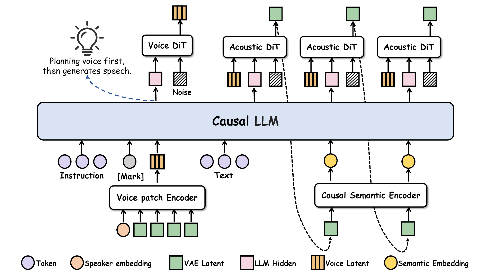

<div align="center">

# VoTSpeech

### Decoupling Voice Design from Speech Generation in Instruction-Following TTS

<p>
  <a href="https://ywbn.github.io/VoTSpeech/"></a>
  <a href="https://huggingface.co/Ywbn16/VoTSpeech"></a>
</p>

</div>

---

VoTSpeech (Voice-of-Thought Speech) separates voice design from speech generation through an explicit continuous voice representation. Given a natural-language voice instruction, a shared causal language model first guides a flow-based Voice DiT to design the voice. The resulting voice latent then conditions both language modeling and acoustic generation.



## Highlights

- Explicitly separates *what voice to create* from *what that voice says*.
- Combines speaker identity features and pooled audio VAE latents to supervise the voice representation.
- Uses dual-path conditioning to connect semantic planning with acoustic rendering.
- Trained with 1,543.52 hours of Chinese task-specific adaptation data.
- Achieves 84.8% APS, 78.5% DSD, and 66.9% RP instruction-following accuracy on InstructTTSEval-ZH, with a 2.58% character error rate.

## Paper results

| Model | APS ↑ | DSD ↑ | RP ↑ | CER ↓ | Naturalness ↑ | Expressiveness ↑ | Adherence ↑ |
|---|---:|---:|---:|---:|---:|---:|---:|
| **VoTSpeech (Ours)** | 84.8 | **78.5** | **66.9** | 2.58 | **4.12 ± 0.22** | **4.30 ± 0.18** | **4.26 ± 0.19** |
| Ming-Omni-TTS-0.5B | 84.9 | 72.2 | 53.9 | **2.48** | 3.71 ± 0.27 | 3.71 ± 0.24 | 3.75 ± 0.25 |
| Qwen3-TTS-12Hz-1.7B-VD | **87.1** | <u>76.0</u> | 55.2 | 2.99 | <u>4.08 ± 0.21</u> | 4.10 ± 0.19 | <u>4.06 ± 0.20</u> |
| MOSS-VoiceGenerator | 73.1 | 70.2 | 58.9 | 5.03 | 3.86 ± 0.22 | 3.72 ± 0.18 | 3.70 ± 0.19 |
| VoxCPM2 | 84.7 | 71.8 | 56.8 | <u>2.58</u> | 3.80 ± 0.25 | 3.82 ± 0.18 | 3.82 ± 0.17 |
| dots.tts-soar (fine-tuning) | <u>85.3</u> | 75.0 | <u>64.3</u> | 2.71 | 3.87 ± 0.23 | <u>4.12 ± 0.18</u> | 3.96 ± 0.19 |

Instruction-following performance is evaluated on **InstructTTSEval-ZH**. Following its evaluation protocol, **Gemini 2.5 Pro** assesses compliance for Acoustic-Parameter Specification (APS), Descriptive-Style Directive (DSD), and Role-Play (RP), with accuracy reported as a percentage. Speech intelligibility is measured by the overall character error rate (CER) across all three categories using a pretrained **Paraformer-ZH** ASR model.

For subjective evaluation, **24 listeners** rate outputs from every system on the same **10 randomly selected examples** using a five-point scale. Naturalness measures perceived audio quality, Expressiveness measures how well the delivery fits the synthesis text, and Adherence measures compliance with the voice-design instruction. The table reports mean opinion scores with **95% confidence intervals**.

Bold and underline mark the best and second-best means in each column.

## Installation

VoTSpeech requires Linux, Python 3.10–3.12, and a CUDA-capable GPU. We
recommend installing it in a clean environment:

```bash
git clone https://github.com/ywbn/VoTSpeech.git
cd VoTSpeech

conda create -n votspeech python=3.10 -y
conda activate votspeech
pip install -r requirements.txt
```

The inference implementation is included in [`inference/`](inference/).
Model weights are available from
[`Ywbn16/VoTSpeech`](https://huggingface.co/Ywbn16/VoTSpeech) on Hugging Face
and are intentionally excluded from this GitHub repository. The runtime can
download the checkpoint automatically when the repository ID is passed as
`MODEL_NAME_OR_PATH`.

## Inference

### JSONL input

For ordinary voice design, use one JSON object per line with `text` (the words
to speak) and `instruction` (the desired voice). We recommend a unique `id`
to name each output. The included [`examples/voice_design.jsonl`](examples/voice_design.jsonl)
uses this format:

```json
{"id":"example_zh","text":"今天阳光很好，我们一起出去走走吧。","instruction":"一位年轻女性，声音温暖明亮，语速自然，带着轻松愉快的情绪。"}
```

This produces one audio file, `default/example_zh.wav`, under your output
directory. `APS`, `DSD`, and `RP` are not required for this format. If `id`
is omitted, the loader uses `uid` or the input line number.

### Single GPU

`MODEL_NAME_OR_PATH` may be a downloaded model directory or a Hugging Face
repository ID.

```bash
MODEL_NAME_OR_PATH=Ywbn16/VoTSpeech \
INPUT_MANIFEST=examples/voice_design.jsonl \
OUTPUT_DIR=outputs/example \
GPU_IDS=0 \
NUM_GPUS=1 \
TTS_LANGUAGE=zh \
SEED=42 \
bash inference/scripts/run_batch_infer_voice_design.sh
```

### Multiple GPUs

Multi-GPU inference launches one independent model process per GPU and does
not use DDP or NCCL. Existing non-empty WAV files are skipped by default.

```bash
MODEL_NAME_OR_PATH=Ywbn16/VoTSpeech \
INPUT_MANIFEST=examples/voice_design.jsonl \
OUTPUT_DIR=outputs/example \
GPU_IDS=0,1,2,3 \
NUM_GPUS=4 \
TTS_LANGUAGE=zh \
SEED=1542 \
bash inference/scripts/run_batch_infer_voice_design.sh
```

Use a JSONL file with multiple rows to distribute requests across GPUs.

### InstructTTSEval input (optional)

For benchmark-style generation, supply `text` and one or more of the following
instruction fields instead of the top-level `instruction`:

- `APS`: Acoustic-Parameter Specification.
- `DSD`: Descriptive-Style Directive.
- `RP`: Role-Play.

For example, [`examples/instructttseval_format.jsonl`](examples/instructttseval_format.jsonl)
contains the following illustrative input (one JSON object on one line):

```json
{"id":"example_zh","text":"今天阳光很好，我们一起出去走走吧。","APS":"年轻女性，音高偏高，语速适中，音量适中。","DSD":"声音温暖明亮，语气轻松自然，带着愉快的情绪。","RP":"你是一位热情的导游，正在邀请游客一起散步。"}
```

Use this file as `INPUT_MANIFEST` in either command above. With these string
fields, the three outputs are `APS/example_zh_APS.wav`,
`DSD/example_zh_DSD.wav`, and `RP/example_zh_RP.wav`.
JSONL also supports nested fields such as `"APS": {"instruction": "..."}`;
these retain the original ID, producing `APS/example_zh.wav`.
If a non-empty top-level `instruction` is present, it takes precedence over
the benchmark fields. By default, all available non-empty APS/DSD/RP fields
are processed; set `VARIANTS=APS,DSD` to select a subset.

For an InstructTTSEval-ZH Parquet file, the convenience wrapper infers `NUM_GPUS` from
`GPU_IDS`:

```bash
MODEL_NAME_OR_PATH=Ywbn16/VoTSpeech \
GPU_IDS=0,1,2,3 \
bash examples/infer_instructttseval.sh /path/to/zh.parquet outputs/instructttseval_zh
```

Audio is always saved beneath `OUTPUT_DIR`; input `gen_path` values do not
control the output location. A
`results.jsonl` manifest records the instruction, output path, seed, runtime,
and generation status for each request.

## License

- **Inference code:** [Apache-2.0](inference/LICENSE).
- **VoTSpeech model weights:** [CC BY-NC 4.0](https://creativecommons.org/licenses/by-nc/4.0/).
  Non-commercial use, sharing, and adaptation are permitted with appropriate
  credit, a license link, and an indication of changes. When sharing the
  weights or adaptations, credit VoTSpeech and link to the
  [model repository](https://huggingface.co/Ywbn16/VoTSpeech).

No training datasets or original training recordings are distributed with this
release. Rights in third-party recordings, texts, performances, and other
source materials remain with their respective rights holders. The weight
license does not grant rights to those materials or waive privacy, publicity,
or personality rights, and does not replace separately applicable data-use
agreements.

## Responsible use

VoTSpeech is intended for research and evaluation of instruction-guided voice
design and expressive speech synthesis. Commercial use of the licensed weights
is not permitted under CC BY-NC 4.0.

We ask users to identify publicly shared outputs as synthetic speech, obtain
any permissions needed when imitating an identifiable voice, and avoid
deceptive impersonation, fraud, harassment, or privacy-invasive applications.
These are responsible-use recommendations, not additional CC license terms.

The model may produce inaccurate pronunciations, unintended voice attributes,
or audio artifacts. It is provided as is, without warranties, to the extent
permitted by law. Please assess generated outputs before using them. Licensing
or rights concerns can be raised through the
[Hugging Face community page](https://huggingface.co/Ywbn16/VoTSpeech/discussions);
please do not post sensitive personal information publicly.

## Authors

Wenbing Yang¹, Qihang Lu², Zihan Sun², Peilei Jia², Yingming Gao¹, Ya Li¹, and Jun Gao²

¹ Beijing University of Posts and Telecommunications  
² Hello Group Inc.
